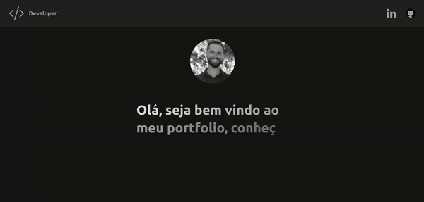

<h2><b>✏️ Sobre</b></h2> 

## Meu Portfólio

 

 <h2>🚧 Ainda em construção, ocorrerão melhorias 🚧</h2>

 

[Conectando a API do Github](https://api.github.com/users/jaocordeiro/repos)

<h2><b>  👨🏻‍💻 Bibliotecas utilizadas no projeto</b></h2>

- [NextJs](https://beta.nextjs.org/docs)

  - **NextJs** é um framework para React, pode ser utilizado para o desenvolvimento de aplicações/sites web com JavaScript.

- [Tailwindcss](https://tailwindcss.com/)

  - O **Tailwind** CSS é um framework CSS de código aberto que permite criar rapidamente estilos personalizados para seus projetos. O mesmo fornece classes que podem ser combinadas para criar seus próprios estilos.

- [SwiperJs](https://swiperjs.com/react)
  - O **SwiperJs** é um framework de React criado e utilizado para apresentações nas formas de slides ou carousel de uma maneira moderna, estilizada e fácil de se implementar.

---

<h2><b> 🖥 Resultado final da aplicação</b></h2> 

---

<h2><b> 💻 Requisitos para rodar o projeto</b></h2>

- **Node.js** - version >= `18.9.0`
- **NPM** - version >= `8.19.1`
- **Next.js** - version >= `13.0.0`

---

<h2><b> 👨🏻‍💻 Como iniciar o Projeto:</b></h2> 

Efetuar o clone deste repositório, colando em seu terminal o seguinte comando:

`https://github.com/jaocordeiro/my_portfolio.git`

Após clonar o repositório, acessar a pasta `my-portfolio` rodar o comando **npm run dev** e o site estará rodando em seu
local.

---

 <h2><b>
Obrigado 😃
</b><h2>
